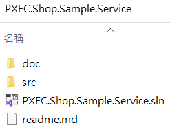
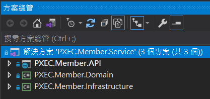
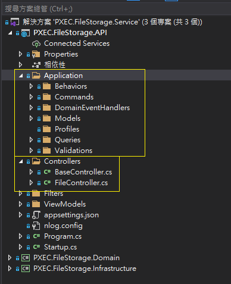
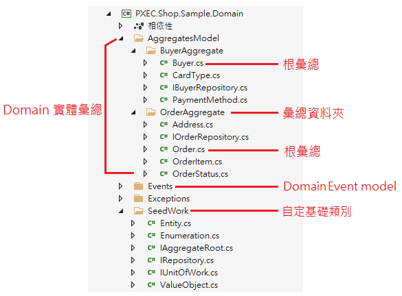
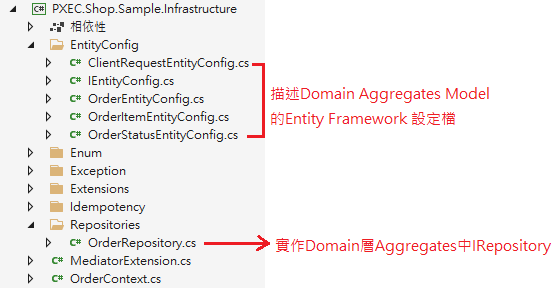

# .NET 後端服務開發指引

## 架構規範

服務架構模式均採用 DDD(domain-driven design 領域驅動設計) + CQRS(Command and Query Responsibility Segregation 命令和查詢職責分離) + Event-driven architecture(事件驅動架構)方式設計。

### `CQRS 命令和查詢職責分離(讀寫分離)`

1. CQRS區分Query(只查詢不異動資料)與Command(增刪改異動資料)兩種。
2. Query 取得回傳值，不改變系統與資料。
3. Command 新增或修改資料。

### `DDD 領域驅動設計`

1. 以商務領域作為設計驅動與Service的劃分依據，例如會員/行銷/交易/物流等，亦可再區分一層子領域。
2. 由內而外的設計方式，先分析商業領域邏輯核心後，在不考慮外部的前端API呈現與資料庫(表)設計的前提下，先設計領域實體(Entity)與提供的方法邏輯，之後依據實體(Entity)現況設計資料表，資料庫用來儲存領域實體處理完邏輯到最後階段的實體資料狀態，非過程中任何變更都需更新資料庫。
3. 資料庫依各領域微服務自行攜帶設計，微服務間資料庫不共用不互通，皆透過API/MQ/Redis做資料交換，不設計資料大表。
4. 每個微服務以1-3個資料實體為佳，多的可以考量是否再劃分其他服務。

### `Event-driven architecture(事件驅動架構)`

1. 同一服務的Command/Domain Event 透過 MediatR 完成不同層間的事件驅動。
2. 不同服務間的非同步協作通過 Events backbone做彼此通訊傳遞的介質(RabbitMQ)。
3. 整體服務的資料同步設計方式優先以最終一致性為主。譬如建立訂單動作可在建立訂單完成後回覆使用者訂單建立完成，再以非同步的方式通知出貨服務接手處理後續動作。
4. 協調式 SAGA Pattern + Event-driven。

參考
1. [使用 DDD 與 CQRS 模式解決微服務中的商務複雜度](https://docs.microsoft.com/zh-tw/dotnet/architecture/microservices/microservice-ddd-cqrs-patterns/)
2. [在 CQRS 微服務中實作讀取/查詢](https://docs.microsoft.com/zh-tw/dotnet/architecture/microservices/microservice-ddd-cqrs-patterns/cqrs-microservice-reads)
3. [事件驅動架構樣式](https://docs.microsoft.com/zh-tw/azure/architecture/guide/architecture-styles/event-driven)
4. [Saga 分散式交易](https://docs.microsoft.com/zh-tw/azure/architecture/reference-architectures/saga/saga) 
5. [2020 DDDTW 年會 - CQRS 與 SAGA 解決微服務什麼問題 - Rex 王鈞平](https://www.youtube.com/watch?v=crS6htkx6LU)


## **方案規範**

### `命名規範`

1. 方案與專案包括內含檔案以大駝峰方式命名
2. 方案與資料夾命名格式<br>
    `PXEC.{商模類型}.{領域}.Service`<br>
    `PXEC.{商模類型}.{主領域}.{子領域}.service`<br>
    `共通類型: PXEC.{領域}.Service`
<br>
```
Ex:
    PXEC.Authentication.Service
    PXEC.Member.Service
    PXEC.Groupbuying.Marketing.Event.Service
    PXEC.Groupbuying.Marketing.Coupon.Service
    PXEC.Shop.Product.Service
```
3. 專案檔案統一放置 src 目錄底下

### `目錄結構`


|Name   |type|Description|
|-------|----|-----------|
|PXEC.Shop.Sample.Service    |Folder   |根目錄     |
|doc                         |Folder   |文件目錄   |
|src                         |Folder   |原始碼目錄 |
|PXEC.Shop.Sample.Service.sln|File     |方案檔     |
|readme.md                   |File     |方案說明檔  |
<br>

## **專案結構**
### `命名規範`
專案名稱命名格式<br>
`{方案名稱(不含Service)}.{專案類型}`

範例
```
    方案資料夾: PXEC.Group.Member.Service
    內含專案:
    PXEC.Groupbuying.Member.Api
    PXEC.Groupbuying.Member.Domain
    PXEC.Groupbuying.Member.Infrastructure
```

### `目錄結構`



|Name|Description|
|---------------|-----------|
|Api            |對外界面與應用層 (EventHandle、CommandHandle)|
|Domain         |領域層 (實體、商務邏輯)      |
|Infrastructure |基礎架構層 (db/redis/io)   |

## **API專案**
1. 實作 Controller & Filter & Application(DomainEventHandle/Commands/Queries)
2. 參考 Infrastructure, Domain 專案

## `目錄結構`


|Name   |type|Description|
|-------|----|-----------|
| Application       |Folder| Application層 |
|├ Behaviors |Folder| Behaviors 層(MediatR行為實作) |
|├ Commands  |Folder| Command/CommandHander  |
|├ DomainEventHandlers|Folder|領域事件Handler|
|├ Models|Folder|APP層Model|
|├ Profiles|Folder|Automaper Profiles存放位置|
|├ Queries|Folder|CQRS Query 存放|
|└ Validations|Folder|FluentValidation驗證class|
|Controllers    |Folder   |Controller             |
|Filters        |Folder   |                    |
|ViewModels     |Folder   |RequestVo, ResponseVo  |


## **Domain專案**

1. 領域實體層專案
2. 遵循 POCO Entity Classes(clean c# code)
3. 可與 NuGet 套件相依，不允許與其他任何自定層或自訂程式庫相依

### `目錄結構(範例)`


|Name   |type|Description|
|-------|----|-----------|
|AggregatesModel     |Folder   |各彙總目錄存放     |
|BuyerAggregatesModel|Folder   |購買人實體彙總目錄 |
|OrderAggregatesModel|Folder   |訂單實體彙總目錄    |
|Events              |Folder   |領域事件資料夾     |
|SeedWork            |Folder     |自訂基礎類別資料夾|

1. 每個彙總有各自資料夾存放
2. 每個彙總都會有一個根類別
3. 每個彙總有一份 Repository interface 合約
4. 單一彙總內所有非根類別皆屬於根類別屬性成員
5. 操作所有屬性成員皆需透過根類別 method 執行
6. 不可單獨操作或宣告彙總成員使用
7. Domain層進行對外I/O(ex:db, redis, file ..)以發出領域事件 Domain Event 方式進行
8. 其餘使用到的基礎類別可定義在 SeedWork 資料夾

## **Infrastructure 專案**
1. 基礎設施層專案
2. 被 API 層參考相依(除Domain層)
3. 所有跨層參考套件(NuGet)相依性皆新增在此(除Domain層)
4. 實作包括DBContext, I/O(Redis, stream..), 較用外部API, MQ, 領域事件/命令發佈分派(MediatR)等
5. 實體的操作所派發出的事件會在儲存實體(entity SaveChange)時一併處理。

### `事件發送器`


參考來源 微軟 .NET微服務：容器化 .NET 應用程式的架構(Nish Anil)

### `目錄結構`

|Name   |type|Description|
|-------|----|-----------|
|EntityConfig   |Folder   |EF 設定檔       |
|Enum           |Folder   |共用列舉         |
|Repositories   |Folder   |實作Repository   |
|OrderContext.cs|File     |EF 合約          |


## **共同設計規範**
1. 開發設計新服務順序 Domain -> Application.Command -> Infra -> WebApi
2. 只有 Command 可操作 Domain 實體
3. Query 的DB查詢與邏輯統一寫在 Application.Queries 中，以Dapper做ORM，並由WebApi呼叫使用
4. 不寫通用類別方法 ex: Facade / Helper / CommonTool 等，請將邏輯集中在Domain Entity上。
5. 全域變數請以下底線開頭與小寫開頭 ex: private readonly string _authRepository;
6. Model 不可跨層使用，請以AutoMapper做轉換或使用隱含型別var。
7. 使用FluentValidation或System.ComponentModel.DataAnnotations做資料驗證。
8. API回傳值命名規範開頭小寫單字以底線分隔 ex: employee_no / user_id / refresh_token